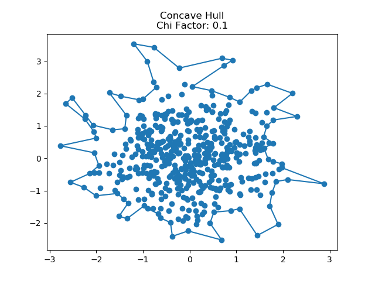

# Concave Hull

Finds the concave hull around a set of 2D points using an implementation based on a paper from M. Duckham, et al [1]. The paper uses the term __*characteristic shape*__ to refer to the shapes generated by the algorithm. The concavity of the shape depends on a scalar ranging from 0 to 1 called the chi factor. A value of 0 leads to the most concave, and 1 leads to the convex hull.

The algorithm is implemented in C++, and python bindings are available through pybind11.

The algorithm begins by finding the Delaunay triagulation of a set of 2D points using [https://github.com/abellgithub/delaunator-cpp](https://github.com/abellgithub/delaunator-cpp), initializes the hull to the convex hull, then iteratively adds points to the hull until some stopping condition is met. The algorithm iteratively selects the largest triangle edge on the outside hull, and if the third triangle point is not on the hull, proceeds to remove this edge and add the two other edges connected to this point to the hull.

# Installation

``` bash
pip install .
```

# Usage

``` python
from concavehull import concavehull

# 2D points
n = 1000
pts = np.random.randn(n, 2)

ch = concavehull(pts, chi_factor=0.05)

plt.scatter(pts[:,0], pts[:,1], label="points")
plt.plot(ch[:,0], ch[:,1], label="concave hull")
```



# References
[1] M. Duckham, L. Kulik, M. F. Worboys, and A. Galton. Efficient generation of simple polygons for characterizing the shape of a set of points in the plane. Pattern Recognition, 41:3224–3236, 2008. 
